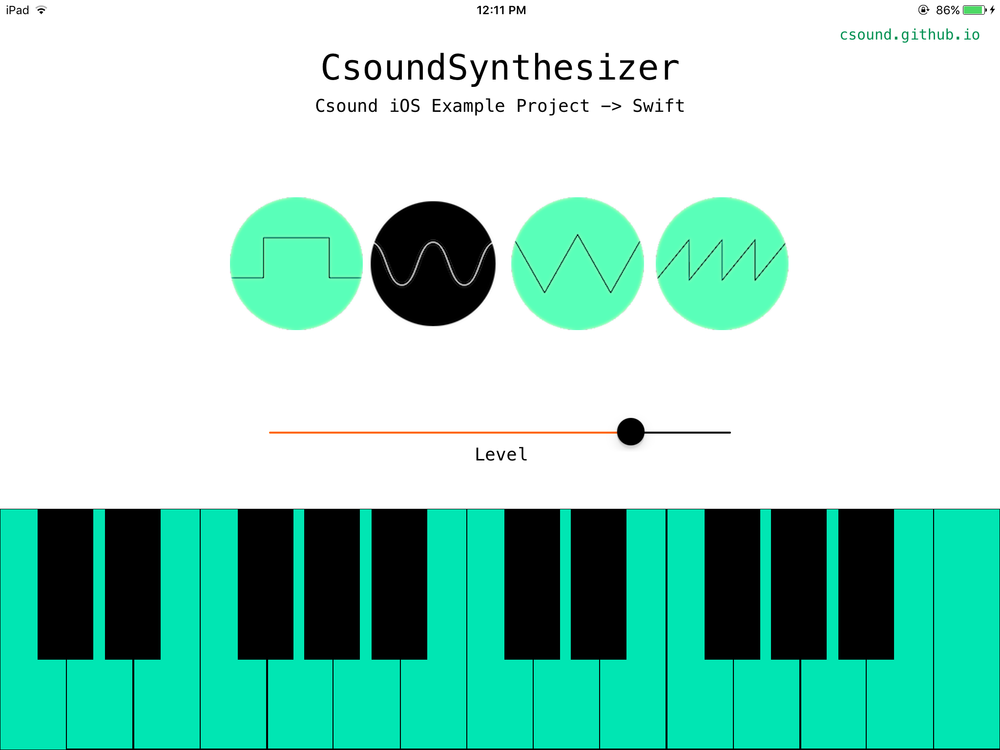

# csoundSynthesizer
A rudimentary synthesizer for the iPad that uses the Csound iOS API, in both Swift and Objective-C.

This project is not intended to be an exhaustive demonstration of the Csound iOS API: the Csound iOS Examples Project (also available in both Swift and Objective-C) is a better resource for that. This is a small example that is intended to be easy to use and navigate, and is based on one of the introductory examples from the course _EP P453: Audio Programming for the iPad_ at the Berklee College of Music.

## Links

- [Csound](http://csound.github.io/)
- [Csound Manual](http://csound.github.io/docs/manual/)
- [Csound Sources](https://github.com/csound/csound)
